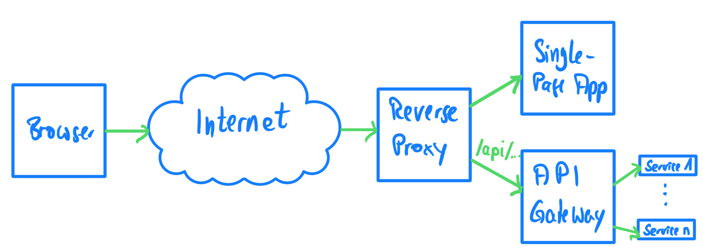

# Traefik Playground

tl;dr This is all about replacing Nginx with Traefik.

## About

I run most of the applications I run productively as containers. Usually, I put an Nginx instance as reverse proxy (
or "edge router", as Traefik calls it) in front of it to hide my application architecture (typically at least separating
the frontend from the API gateway). For this purpose, I use different path prefixes to distinguish between requests for
the former or the latter.



My goal was to replace Nginx with _Traefik_. Since the latter is container-aware, my expectation is that this will
result in a much simpler configuration.

With this document, I would like to remind my future self how it works. A repository containing all the sources can be
found on [GitHub](https://github.com/MichaelKaaden/traefik-playground.git).

**Hint:** I use Docker to run my applications, so I also describe everything here in terms of Docker. For Kubernetes,
there are some differences that you need to be aware of, so please have a look at the documentation for details.

## Quick Start

For the first steps, let's create a `docker-compose.yml` file that defines a simple application consisting of only
Traefik and a "Who Am I" service to show the request headers and the container ID:

```dockerfile
version: "3"

services:
  traefik:
    # the official v2.5 Traefik docker image
    image: traefik:v2.5
    command:
      # let's use Docker as our infrastructure
      - "--providers.docker=true"
    ports:
      # the HTTP port
      # or e. g. "10080:80" if port 80 is in use on your box
      - "80:80" 
    volumes:
      # so that Traefik can listen to the Docker events
      - "/var/run/docker.sock:/var/run/docker.sock:ro"

  whoami:
    # a container that exposes an API to show its IP address
    image: traefik/whoami
    labels:
      # use a catch-all router here
      - "traefik.http.routers.whoami.rule=PathPrefix(`/`)"
```

The most interesting part is the label in the `whoami` service definition. It tells Traefik to route every HTTP URL
starting with `/` to the `whoami` service. Of course, there are many other rules like matching for hostnames, too.
That's what the [Traefik manual](https://doc.traefik.io/traefik/routing/routers/#rule) is for. ;-)

Traefik has both
a [static and a dynamic configuration](https://doc.traefik.io/traefik/getting-started/configuration-overview/). The
former sets Traefik up, the latter defines how requests are going to be handled. In the example above, the `command`
defines the static configuration, and the `labels` set up the dynamic configuration.

Now run this minimal application with `docker-compose up -d`. I'm sure you know that to stop it later on you'd have to
use `docker-compose down --remove-orphans`, or to see its log output, you'd use `docker-compose logs -f`.

To prove this very simple application is working, let's use `curl` to send requests to it:

```
$ curl http://localhost
Hostname: eb366908f606
IP: 127.0.0.1
IP: 172.22.0.2
RemoteAddr: 172.22.0.3:60940
GET / HTTP/1.1
Host: localhost
User-Agent: curl/7.77.0
Accept: */*
Accept-Encoding: gzip
X-Forwarded-For: 172.22.0.1
X-Forwarded-Host: localhost
X-Forwarded-Port: 80
X-Forwarded-Proto: http
X-Forwarded-Server: 9f52348d0258
X-Real-Ip: 172.22.0.1
```

As you can see, Traefik redirects the URL `/` to the `whois` service. More than that, it redirects _every_ URL to it and
shows the complete HTTP request, so you can use this service to debug your edge router later on.

Without much ado, Traefik handles multiple instances of the same service by load-balancing them. Try it out for yourself
with `docker-compose up -d --scale whoami=2`. Sending requests via `curl`, you'll see they're handled by different
containers by looking at the "Hostname" in the response.

## Routing Requests To A Second Service

Now for something a bit more complicated: Let's add another service. We'll redirect HTTP requests to this second service
with its own routing prefix (remember, we could use host parts or other rules, too). So you know how to extend this
principle to any number of services.

We'll keep the `whois` service and add an `nginx` service -- the latter will respond with 404 pages to whatever request
it receives. This will be sufficient to make it clear which container sent the response.

Now append the following service definition to the previously created `docker-compose.yml`:

```dockerfile
  # ...
  nginx:
    image: nginx:mainline-alpine
    labels:
      - "traefik.http.routers.nginx.rule=PathPrefix(`/nginx`)"
```

Now, GETting `/` still routes to the `whoami` service:

```
$ curl http://localhost
Hostname: 2714027ccf2b
IP: 127.0.0.1
IP: 172.23.0.2
RemoteAddr: 172.23.0.4:39188
GET / HTTP/1.1
Host: localhost
User-Agent: curl/7.77.0
Accept: */*
Accept-Encoding: gzip
X-Forwarded-For: 172.23.0.1
X-Forwarded-Host: localhost
X-Forwarded-Port: 80
X-Forwarded-Proto: http
X-Forwarded-Server: 8b3ce5131fb2
X-Real-Ip: 172.23.0.1
```

Requests for `/nginx` instead are redirected to the `nginx` service -- as expected.

```
$ curl http://localhost/nginx
<html>
<head><title>404 Not Found</title></head>
<body>
<center><h1>404 Not Found</h1></center>
<hr><center>nginx/1.21.4</center>
</body>
</html>
```

The interesting part for me is that I did _not_ have to specify any forwarders in an Nginx configuration file nor had to
explicitly specify hostnames, ports, or networks. Everything could be done with a simple label in
the `docker-compose.yml`. Great!

There's still one catch: As I pointed every request starting with `/nginx` to the second service, it will also see this
prefix in the request it receives. Here's the relevant part of the log:

```
nginx_1    | 2021/12/30 07:28:29 [error] 33#33: *1 open() "/usr/share/nginx/html/nginx" failed (2: No such file or directory), client: 172.23.0.4, server: localhost, request: "GET /nginx HTTP/1.1", host: "localhost"
```

Here you can clearly see the problem mentioned before: `request: "GET /nginx HTTP/1.1"`.

## Removing The Request's Prefix

We want the request to hit the service _without_ the prefix we only use for routing decisions. That's an easy one.

Just append those two labels to the `nginx` service definition in your `docker-compose.yml` file:

```
      - "traefik.http.middlewares.nginx-stripprefix.stripprefix.prefixes=/nginx"
      - "traefik.http.routers.nginx.middlewares=nginx-stripprefix"
```

Te first label creates a middleware called `nginx-stripprefix` that removes ("strips") the HTTP request's path
prefix `/nginx`. The second label then assigns this middleware to the nginx service's router.

Remember that this always is a two-step process -- the Traefik documentation is not very clear about this in the example
code, so this took me a while.

Now let's try this out: `curl http://localhost/nginx`

Here's again the relevant part of the log:

```
nginx_1          | 172.24.0.4 - - [30/Dec/2021:07:45:06 +0000] "GET / HTTP/1.1" 200 615 "-" "curl/7.77.0" "172.24.0.1"
```

Now the request does no longer contain the routing prefix `/nginx`. Perfect! Now we can easily route to various
services.

## Using TLS

One thing remains: TLS termination in Traefik.

In this part, we're going to configure Traefik to use a PEM certificate. If you don't have one handy, then you may of
course use the one I generated for localhost and put in this repo, or you could generate a self-signed one for yourself.

Please create a directory `configuration` next to your `docker-compose.yml` file. Put your certificate inside and create
a file `certificates.yml` there.

This file's contents should be:

```yaml
tls:
  certificates:
    - certFile: /configuration/localhost.crt
      keyFile: /configuration/localhost.key
```

We're now mounting this directory into our Traefik container and use the `certificate.yml` as part of its dynamic
configuration. Apart from that, we mark both services with the `tls` label so both are masked behind the TLS termination
handled by Traefik.

Here's the complete `docker-compose.yml` file to use:

```dockerfile
version: "3"

services:
  reverse-proxy:
    # the official v2 Traefik docker image
    image: traefik:v2.5
    command: 
        # Declares the web entrypoint in Traefik
      - "--entrypoints.web.address=:80"
        # Declares the web-secure entrypoint in Traefik
      - "--entrypoints.web-secure.address=:443"
        # Use Docker
      - "--providers.docker=true"
        # In the dynamic configuration, make sure to use full paths
        # starting with "/configuration" to prevent strange errors like
        # "Error while creating certificate store: failed to load X509 key
        # pair: tls: failed to find any PEM data in certificate input"
      - "--providers.file.directory=/configuration/"
        # watch for changes in the configuration
      - "--providers.file.watch=true"
    ports:
        # the HTTP port
      - "80:80"
        # the HTTPS port
      - "443:443"
    volumes:
        # so that Traefik can listen to the Docker events
      - "/var/run/docker.sock:/var/run/docker.sock:ro"
      - "./configuration/:/configuration/"

  whoami:
    # a container that exposes an API to show its IP address
    image: traefik/whoami
    labels:
      # - "traefik.http.routers.whoami.rule=Host(`whoami.docker.localhost`)"
      # use a catch-all router here
      - "traefik.http.routers.whoami.rule=PathPrefix(`/`)"
      - "traefik.http.routers.whoami.tls=true"

  nginx:
    image: nginx:mainline-alpine
    labels:
      - "traefik.http.routers.nginx.rule=PathPrefix(`/nginx`)"
      - "traefik.http.middlewares.nginx-stripprefix.stripprefix.prefixes=/nginx"
      - "traefik.http.routers.nginx.middlewares=nginx-stripprefix"
      - "traefik.http.routers.nginx.tls=true"
```

Now, let's run this application and use our friend `curl` again to send some requests.

```
$ curl http://localhost
404 page not found
$ curl http://localhost/nginx
404 page not found
```

That's expected -- we now use HTTPS, so the services can no longer be reached via plain HTTP. Of course, we can (and
will!) redirect HTTP to HTTPS. That will happen in the next chapter.

```
$ curl https://localhost
curl: (60) SSL certificate problem: self signed certificate
More details here: https://curl.se/docs/sslcerts.html

curl failed to verify the legitimacy of the server and therefore could not
establish a secure connection to it. To learn more about this situation and
how to fix it, please visit the web page mentioned above.
```

Well, `curl` tries to protect us from ourselves here. We need to use the `-k` or `--insecure` option here.

```
$ curl -k https://localhost
Hostname: 050f2dbc9b04
IP: 127.0.0.1
IP: 172.25.0.2
RemoteAddr: 172.25.0.4:33356
GET / HTTP/1.1
Host: localhost
User-Agent: curl/7.77.0
Accept: */*
Accept-Encoding: gzip
X-Forwarded-For: 172.25.0.1
X-Forwarded-Host: localhost
X-Forwarded-Port: 443
X-Forwarded-Proto: https
X-Forwarded-Server: e5f7f0b5c156
X-Real-Ip: 172.25.0.1
```

The `whois` service tells us it received HTTP and that the protocol was HTTPS -- that's what we expected. We use Traefik
to terminate the HTTPS request and internally send HTTP. That results in great speedup as there's no TLS handshake
slowing down every _internal_ request.

```
$ curl -k https://localhost/nginx
<!DOCTYPE html>
<html>
<head>
<title>Welcome to nginx!</title>
<style>
html { color-scheme: light dark; }
body { width: 35em; margin: 0 auto;
font-family: Tahoma, Verdana, Arial, sans-serif; }
</style>
</head>
<body>
<h1>Welcome to nginx!</h1>
<p>If you see this page, the nginx web server is successfully installed and
working. Further configuration is required.</p>

<p>For online documentation and support please refer to
<a href="http://nginx.org/">nginx.org</a>.<br/>
Commercial support is available at
<a href="http://nginx.com/">nginx.com</a>.</p>

<p><em>Thank you for using nginx.</em></p>
</body>
</html>
```

Now, our services still work, but are now secured using TLS.

## Redirecting HTTP to HTTPS

The last piece of the puzzle is redirecting incoming HTTP requests to HTTPS, therefore promoting them. It's quite easy
to do so. Just add the following to the Traefik service's command:

```yaml
        # Redirect HTTP to HTTPS
        - "--entrypoints.web.http.redirections.entryPoint.to=web-secure"
        - "--entrypoints.web.http.redirections.entryPoint.scheme=https"
        - "--entrypoints.web.http.redirections.entrypoint.permanent=true"
```

With this change, `curl` will behave differently:

```
$ curl http://localhost
Moved Permanently
```

We need to use the `-L` or `--location` option to follow redirects in `curl`. This gives us the expected result:

```
$ curl -Lk http://localhost
Hostname: 27cc452f068e
IP: 127.0.0.1
IP: 172.26.0.2
RemoteAddr: 172.26.0.4:37146
GET / HTTP/1.1
Host: localhost
User-Agent: curl/7.77.0
Accept: */*
Accept-Encoding: gzip
X-Forwarded-For: 172.26.0.1
X-Forwarded-Host: localhost
X-Forwarded-Port: 443
X-Forwarded-Proto: https
X-Forwarded-Server: 5d49b5b82b7e
X-Real-Ip: 172.26.0.1
```

Of course, instead of using more and more command line options for our `curl` command, we could have simply opened the
URL in any browser. :-)

## Conclusion

We now have everything at hand to easily swap out the existing Nginx as reverse proxy (or "edge router") and replace it
with Traefik. Where Nginx relies on a configuration file, everything in Traefik could be done in
the `docker-compose.yml` file. For me, that's much better. Also, load-balancing services is handled automagically.

Keeping a configuration consistent between different applications is much easier when it's only done in one file. So
I'll stick to Traefik for the time being.

I'm very excited to see what will come next. ;-)

## References

- [Traefik 2 & TLS 101](https://traefik.io/blog/traefik-2-tls-101-23b4fbee81f1), Gerald Croes, November 2019
